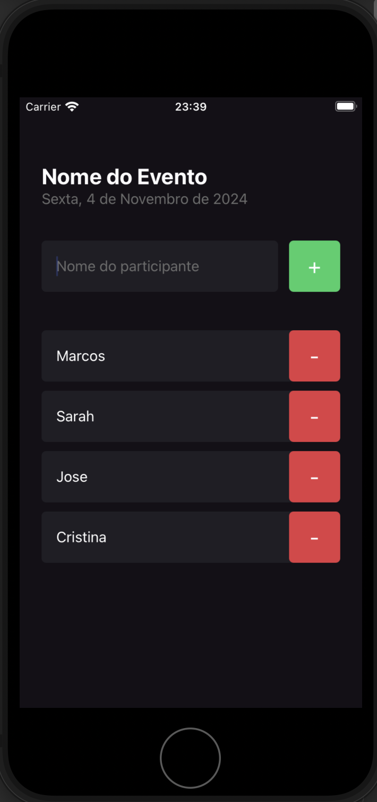

# ImHere

ImHere is a React Native application designed to help users easily create and manage presence lists for events. Whether you are organizing a small meeting or a larger gathering, ImHere provides an intuitive way to track attendees and manage event details.

## Features

- **Create Presence Lists:** Easily add and manage attendees for your events.
- **React Native:** Built for cross-platform support, working on both Android and iOS.

## Project Details

This application was developed as part of the **Ignite** course by Rocketseat, where developers learn modern technologies and best practices for building robust and scalable applications.

## Technologies Used

- **React Native:** A framework for building native apps using React.
- **JavaScript/Typescript:** The core programming language used.
- **Expo:** For easier app development and testing.

## How to Run

1. Clone the repository:
   ```bash
   git clone https://github.com/yourusername/imhere.git
   ```

2. Navigate to the project directory:
   ```bash
   cd imhere
   ```

3. Install dependencies:
   ```bash
   npm install
   ```

4. Start the development server:
   ```bash
   npx expo start
   ```

5. Use the Expo Go app on your mobile device or an emulator to view the application.

## Screenshots



## License

This project is licensed under the MIT License. Feel free to use and modify it as you see fit.

---

For any questions or feedback, feel free to contact me via marcospandrade2@gmail.com.
